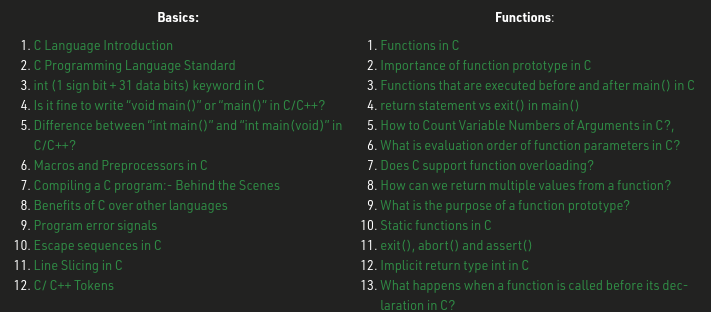

Since I occassionally see people asking for C learning resources on Twitter and co. and also help out other students regarding that matter, I thought sharing my favourite sources here, might be useful for some people.

The sources are going to be divided into different sections:

- A book section
- Tutorial section
- Interactive section
- Video section

The sources might change over time, in case I find another good resource to share with you.

## Book section

### Goalkicker.com

I really like the overall concept of Goalkicker. The site offers books for a big selection of programming languages and is based on the "donate if you like the content" concept, which is especially appealing for students.

The books offer tips and tricks for the language of your choice and explain certain scenarios by using code snippets.

Link: <a href="https://goalkicker.com/CBook/" class="externalLink">https://goalkicker.com/CBook/</a>

### The ANSI C programming language

Being released for the first time in 1978, the Ansi C Pramming language book is kind of classy, when it comes to C programming resources.

The book is very old-school, however contains the most important concepts and exercises along the way.

I recommend this book, because of the many examples of clean code. Trying to understand the many concepts there, is definitely going to help you out, while learning C.

Link: <a href="https://www.amazon.com/Programming-Language-2nd-Brian-Kernighan/dp/0131103628" class="externalLink">https://www.amazon.com/Programming-Language-2nd-Brian-Kernighan/dp/0131103628</a>
(Amazon link, make sure to check your university library or sth. else for a free ebook version!)

---

## Tutorial Section

### Tutorialspoint

Even though the tutorialspoint website looks kind of outdated, considering the design, I can highly recommend this page, especially if you want to revise the fundamental concepts of the C programming language.

Tutorialspoint contains a decent structured overview of all the required topics, and also offers a self-check-exam, in case you want to test your knowledge.

Link: <a href="https://www.tutorialspoint.com/cprogramming/index.htm" class="externalLink">https://www.tutorialspoint.com/cprogramming/index.htm</a>

### GeeksForGeeks

GeeksForGeeks was very helpful for me regarding specific scenarios. 

The website is divided into multiple subcategories, which contain articles about a topic, e.g. Pointers.

Using this website, you are going to learn many important concepts, by thinking about the solution and reading the explanation of each approach.

  

The page is also very useful, in case you want to perform more research regarding a specific matter. As mentioned before, a sub category like "Pointers" contains multiple articles about concepts like "double pointers", which play a key role when building applications in C.

Link: <a href="https://www.geeksforgeeks.org/c-programming-language/" class="externalLink">https://www.geeksforgeeks.org/c-programming-language/</a>

---

## Interactive Section

### Sololearn

Sololearn is my favourite way to learn about programming languages up to today, because of multiple reasons:

- The app is free of charge and offers a huge amount of programming languages
- You can challenge other people and your friends, which is a fun way to stay motivated and learn more while playing
- Encourages programmer-thinking, by giving you challenges, that require an understanding of how code exactly works
- Comes with an awesome community, which helps out each other, in case questions come up
- Using the mobile app you can learn everywhere and also test your code directly in the app

The ads pop up quite often, however I think the app is still pretty decent, especially if you're not in reach of a computer, and still want to train your programming knowledge on the go.

Link: <a href="https://www.sololearn.com/home" class="externalLink">https://www.sololearn.com/home</a>

### CodeWars

CodeWars is a decent platform, which provides programming challenges. Challenges are grouped by a level, the higher you get, the more complexity comes with a challenge.

You can sign up with your friends and stay updated on their current progress - this way you can take on challenges together.

What I really like about the platform is, that after submitting your answer, you can compare it with the approaches from other people. This way you learn new and more elegant solutions for certain problem situations and also train your problem-solving skills.

Link: <a href="https://codewars.com" class="externalLink">https://codewars.com</a>

---

## Video section

### Jacob Sorber

Jacob Sorber has been my far my most favourite YouTube channel regarding C programming.

He talks about C programming concepts in his videos and tries to explain how things work deep down.

By watching his videos, I learned how to write more elegant code and what to do vs. what not to do when building a C application.

Channel Link: <a href="https://youtube.com/c/JacobSorber" class="externalLink">https://youtube.com/c/JacobSorber</a>

### Neso Academy

Neso Academy is an awesome channel. The videos explain idioms in a decent and modern way.

Containing quizes and challenges for yourself in general, Neso Academy tries to make you develop solution-solving approaches on your own, while helping you out.

Neso Academy offers a decent playlist for C programming videos, which I watched many videos from myself and recommended to other students: <a href="https://youtube.com/playlist?list=PLBlnK6fEyqRggZZgYpPMUxdY1CYkZtARR" class="externalLink">https://youtube.com/playlist?list=PLBlnK6fEyqRggZZgYpPMUxdY1CYkZtARR</a>

Channel Link: <a href="https://youtube.com/c/nesoacademy" class="externalLink">https://youtube.com/c/nesoacademy</a>

### Single Videos

#### "How I program in C"

Occasionally I wanted to find different, more challenging content, and looked for "advanced C coding concepts".

A video, which I really enjoyed was "How I program C".

Mr. Steenberg offers a lot of interesting approaches and tricks, which of some I adapted and used in programs myself.

Link: <a href="https://youtu.be/443UNeGrFoM" class="externalLink">https://youtu.be/443UNeGrFoM</a>

#### freeCodeCamp tutorial

Being very popular for a good reason, freeCodeCamp is a decent choice, when trying to get into C programming.

freeCodeCamp offers in-depth programming tutorials, which are also suited for beginners.

Link: <a href="https://youtu.be/KJgsSFOSQv0" class="externalLink">https://youtu.be/KJgsSFOSQv0</a>

---

## Conclusion

There are many more good sources when it comes to C programming. Stackoverflow provides answers to many questions and offers a great community - especially for C programming, it's helpful to have a community, which you can talk to, in case all of your approaches fail, instead of giving up.

There are also many different paid services, which you can use to learn the C programming language, however I do not think, it is necessary to spend money.

Many resources are available on GitHub, and can be found by either looking there or via Google with the site:github.com search operator.

Thanks for reading and stay tuned for more content.